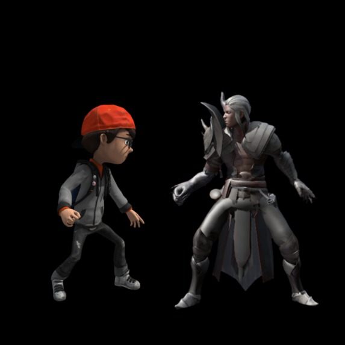
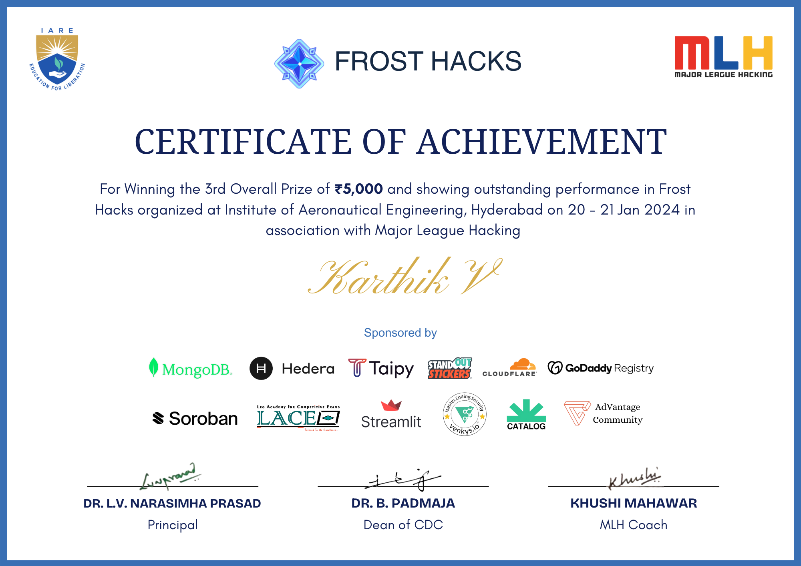
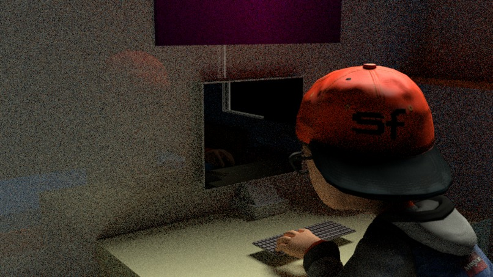
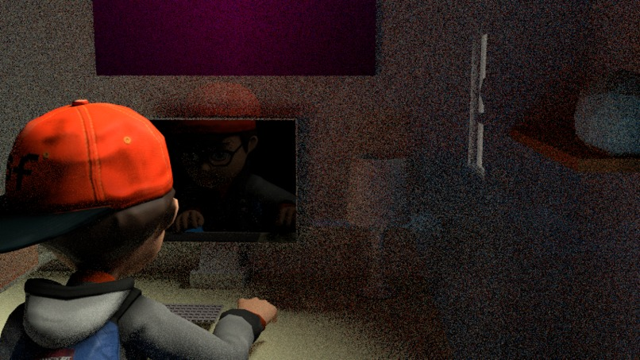
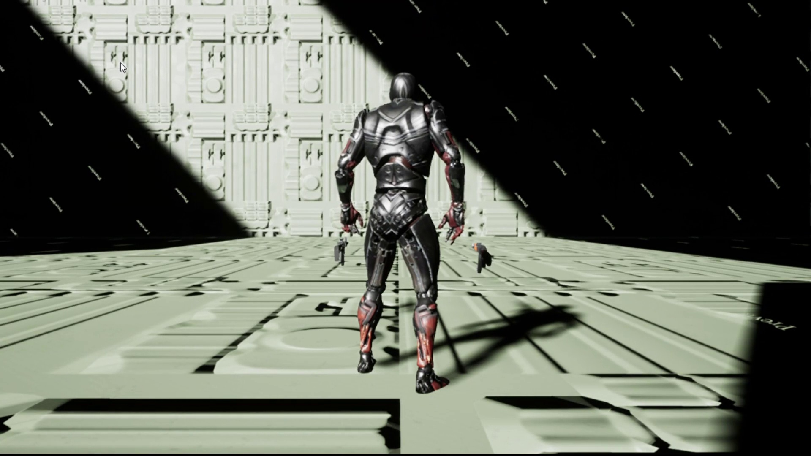
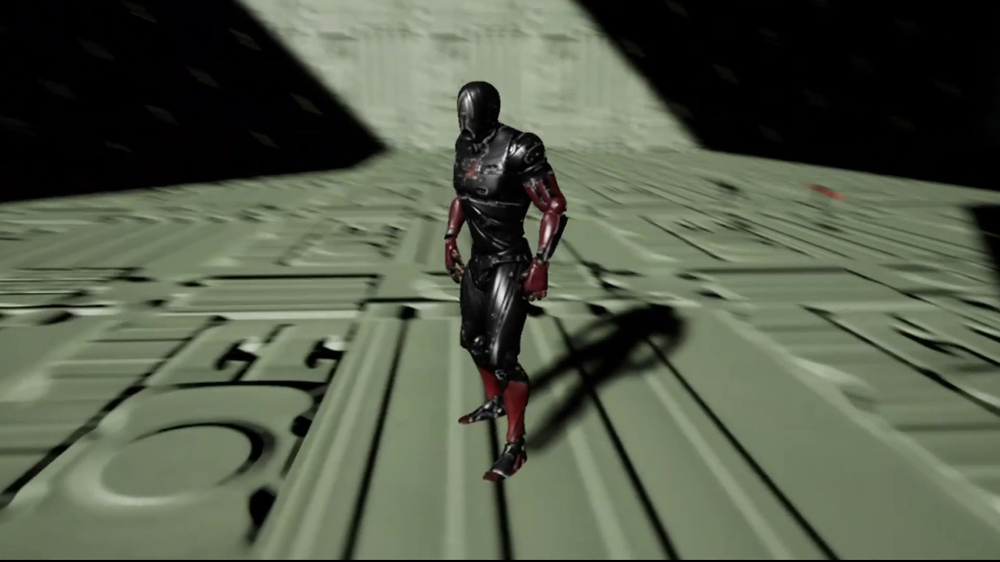
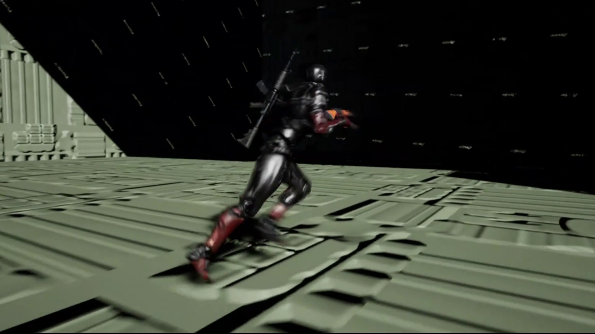

# Geek'O'Wars: Cyber Malware Survival

<div align="center">
  <p align="center">
    
    
    
    <a href="https://karthikveeranala.github.io/portfolio/">
      
    </a>
  </p>

  

  <p align="center">
    <br>
    <a href="Media/Videos/geek_o_wars_gameplay.mp4">
      <strong>[Watch Gameplay Video: Media/Videos/geek_o_wars_gameplay.mp4]</strong>
    </a>
    &bull;
    <a href="https://karthikveeranala.github.io/portfolio/demo-reel/">
      <strong>[Watch on Portfolio Demo Reel]</strong>
    </a>
  </p>
</div>

---

## Overview

**Geek'O'Wars** is a third-person cyber survival shooter developed during the Major League Hacking (**MLH FrostHacks**) hackathon, winning **Top 3 Overall Winner**.

The game immerses the player inside the internal architecture of Jimmy's infected laptop. Operating as an autonomous antivirus defensive construct, the player must battle waves of escalating trojans, malware anomalies, and corrupted system processes across motherboard platforms before system integrity reaches complete failure.

---

## Accolades

<div align="center">
  
  <p><em>Official Major League Hacking (MLH) FrostHacks — Top 3 Overall Winner Certificate</em></p>
</div>

---

## Gameplay Demonstration

A full gameplay capture demonstrating combat loops, weapon mechanics, and enemy wave pacing is included in the repository:

- Local File: [Media/Videos/geek_o_wars_gameplay.mp4](Media/Videos/geek_o_wars_gameplay.mp4)
- Web Demo Reel: [karthikveeranala.github.io/portfolio/demo-reel/](https://karthikveeranala.github.io/portfolio/demo-reel/)

---

## Technical Systems & Combat Mechanics

### 1. Weapon Ballistics & Weapon Switching
- **Projectile Arc & Spread**: Dynamic crosshair bloom and raycast bullet calculations for responsive hit registration.
- **Weapon Arsenal**: Multi-tier cyber firearms featuring automatic pulse rifles, high-impact beam shots, and secondary explosive payloads.
- **Recoil & Camera Shake**: Directional camera kickback impulses scaled to firearm power.

### 2. Malware AI & Wave Spawning
- **Dynamic Wave Management**: Spawner triggers spawn malware waves based on active enemy counts and player proximity.
- **Enemy Behaviors**:
  - *Swarm Bugs*: High-speed melee units executing flanking pathfinding maneuvers.
  - *Ranged Pathogens*: Stationary artillery units launching tracking explosive clusters.
  - *Corrupted Brutes*: Armored malware with high hit points and ground-slam knockback mechanics.

### 3. Cyber Arena Architecture & Visuals
- **Motherboard Level Design**: Cybernetic aesthetic built using stylized circuit-board geometry, glowing traces, and floating platform bridges.
- **System Integrity HUD**: Real-time HUD displaying player shields, current ammunition reserves, and remaining system health percentage.

---

## Screenshot Gallery

| Cyber Encounter Arena | Tactical Firearm Combat |
| :---: | :---: |
|  |  |

| Malware Swarm Attack | Circuit Platform Navigation |
| :---: | :---: |
|  |  |

<div align="center">
  
</div>

---

## Controls

| Action | Primary Input | Description |
| :--- | :--- | :--- |
| Move | W / A / S / D | Character movement |
| Aim / Turn | Mouse | Camera orientation |
| Fire Primary | Left Mouse Button | Shoot weapon |
| Aim Down Sights (ADS) | Right Mouse Button | Focus reticle & zoom camera |
| Sprint | Left Shift | High-speed dash |
| Jump | Space | Jump over hazards and between circuit platforms |
| Reload | R | Reload active magazine |
| Swap Weapon | 1 / 2 / Mouse Wheel | Cycle available cyber firearms |
| Pause / Menu | Esc | Pause match |

---

## Repository Structure

```
Geek-O-Wars/
├── Config/                  # Engine, Input, and Game configuration files
├── Content/
│   ├── AnimStarterPack/     # Locomotion animations and blends
│   ├── FPS_Weapon_Bundle/   # Weapon meshes, textures, and firing effects
│   ├── GameBluePrint/       # Core player, enemy AI, and spawner blueprints
│   ├── UI/                  # Cyber HUD widgets and system telemetry
│   ├── mainmap.umap         # Primary motherboard combat arena
│   └── NewMap.umap          # Secondary testing and wave level
├── Media/
│   ├── Art/                 # Title logos and promotional artwork
│   ├── Audio/               # Voice introduction and combat audio
│   ├── Certificates/        # MLH FrostHacks Top 3 Winner Certificate
│   ├── Screenshots/         # High-resolution action captures
│   └── Videos/              # Full gameplay demonstration video (MP4)
├── .gitignore               # Unreal Engine cache & build exclusions
├── GeekOWArs2.uproject      # Unreal Engine project descriptor (UE 5.6)
└── README.md                # Project documentation and technical details
```

---

## Getting Started

### Prerequisites
- **Unreal Engine 5.6** (or compatible 5.x build)
- **Windows 10 / 11 (64-bit)**
- **DirectX 11 / 12 compatible GPU**

### Opening the Project
1. Clone the repository:
   ```bash
   git clone https://github.com/KarthikVeeranala/Geek-O-Wars.git
   cd Geek-O-Wars
   ```
2. Double-click `GeekOWArs2.uproject` to launch the project in Unreal Editor.
3. In the Content Browser, open `Content/mainmap.umap`.
4. Click **Play in Editor (PIE)** to begin the defense simulation.

---

## Developer & Accolades

- **Award**: Top 3 Overall Winner — Major League Hacking (MLH FrostHacks)
- **Developer**: **Karthik Veeranala** (Game Developer & Designer)
- **Portfolio**: [karthikveeranala.github.io/portfolio](https://karthikveeranala.github.io/portfolio/)
- **LinkedIn**: [linkedin.com/in/karthikveeranala](https://www.linkedin.com/in/karthikveeranala/)
- **GitHub**: [@KarthikVeeranala](https://github.com/KarthikVeeranala)

---

<div align="center">
  <sub>Copyright 2024-2026 Karthik Veeranala. Developed during MLH FrostHacks.</sub>
</div>
